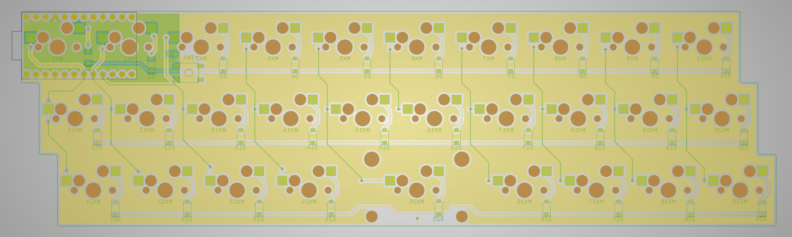

# Omega

The omega is a hot swap 30%(29 keys) inspired by the [Zlant](https://www.reddit.com/r/MechanicalKeyboards/search?q=zlant&restrict_sr=1) and the [Alpha 28](https://geekhack.org/index.php?topic=99040.0) keyboards.

The plate file can be found in the [docs](./docs) folder.

