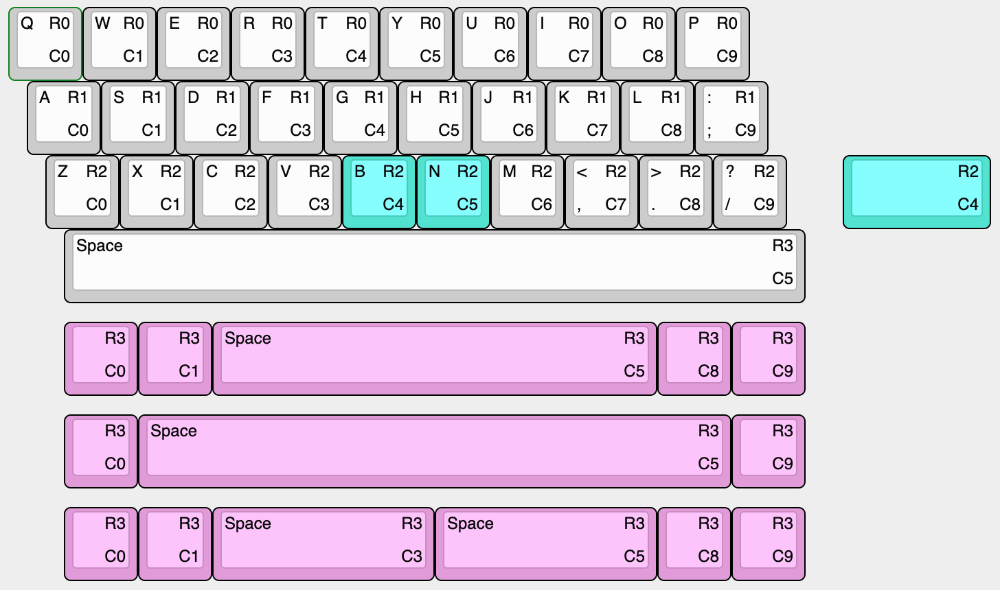

# Omega

Hot swap

Solder

Omega4

The omega is a hot swap 30%(30 or 29 keys depending on the layout you choose) inspired by the [Zlant](https://www.reddit.com/r/MechanicalKeyboards/search?q=zlant&restrict_sr=1) and the [Alpha 28](https://geekhack.org/index.php?topic=99040.0) keyboards.  
The omeaga4 adds a 4th with a few options to make this more than a novelty piece.

The plate files, stls for 3D printing, and STEP files can be found in the [docs](./docs) folder.  
There are also gerbers already generated in the gerber folders.

  

